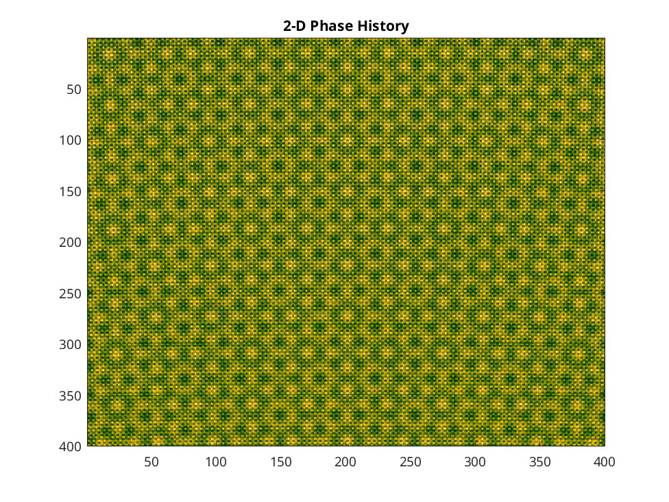
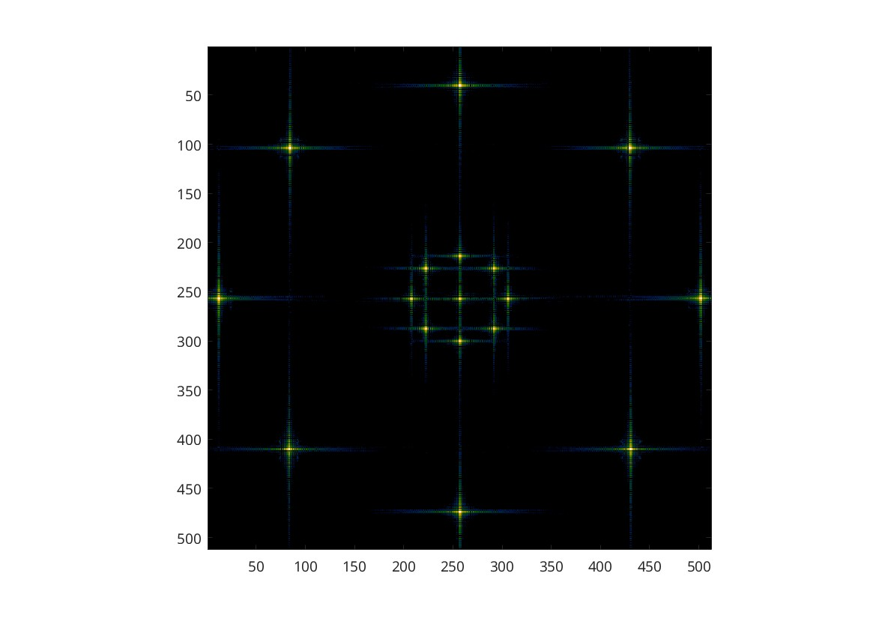

# SAR-Simulator
Matlab code for simulating a synthetic aperture collection. 
This code can be used to understand and generate the simulations in the 
textbook Spotlight-Mode Synthetic Aperture Radar: A Signal Processing Approach. 

Step 0: Build mex file gcbp_sub.c  (on linux with gcc use command 'mex gcbp_sub.c)

Step 1:
Edit the config file (config.txt) using the parameters in config_explain.txt. 
Make sure the paths to each needed .txt file are correct. Here is how config should be setup:

10e9        % radar center frequency (Hz)
4.015e8     % radar transmitter bandwidth (Hz)
1.0e12      % input chirp rate (Hz/sec)
163.5       % pulse rep rate (Hz)
1.0e6       % input video a/d sample rate after deramp (Hz)
150         % footprint size (m)
0.1         % signal to noise ratio
directory path to tx path file (e.g., path.txt)
directory path to rx path file (e.g., path.txt)
directory path to target file (e.g., tgtfile.txt)
directory path to pointing vector file (e.g., bout.txt)
directory path to phase history file (e.g., phr)

Step 2:
Edit the target file (tgtfile.txt) to adjust point target amplitudes, positions 
and velocities. Try different target configutartions when rerunning simulator.
The target file tgtfile_circle is provided for an example.

Step 3:
If desired, edit the SAR platform path information at top of sar_simulator.m
The path information will be saved to path.txt (or user defined name).
Run the macro sar_simulator.m and follow the command prompts. 
Note: There are many editable parameters in the code. Some of them have 
been hard coded with the option to uncomment the interactive prompts.

